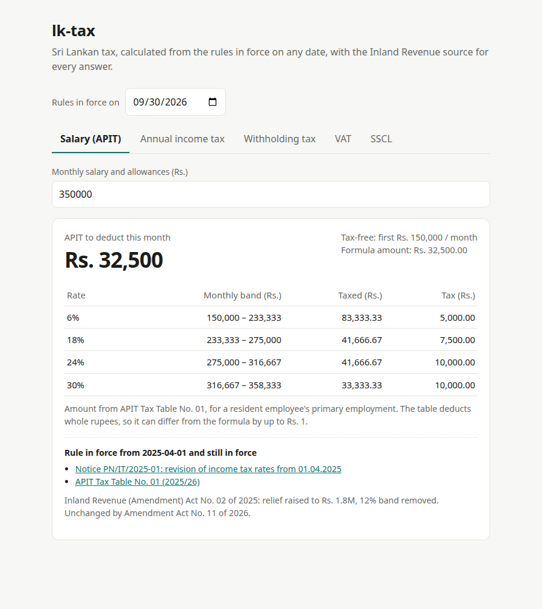

# lk-tax

**Sri Lankan tax rules as code.** APIT, income tax, withholding tax, VAT and SSCL, calculated
from the rules in force on any date since 1 January 2023, with the Inland Revenue Department
source for every answer.

**[Try the calculator →](https://shalomhunukumbura.github.io/lk-tax/)** It runs entirely in your
browser: the same Python package, via WebAssembly, so nothing you type is sent anywhere.

```python
>>> import lk_tax
>>> r = lk_tax.apit_monthly(350_000, on="2026-09-30")
>>> r.tax
Decimal('32500.00')
>>> r.rule.effective_from, r.rule.sources[0].title
(datetime.date(2025, 4, 1), 'Notice PN/IT/2025-01: revision of income tax rates from 01.04.2025')

>>> lk_tax.apit_monthly(350_000, on="2025-03-31").tax     # the old rates
Decimal('52500.00')
```



## Why

Sri Lankan tax rules change often, and usually mid-year. In 2026 alone the SSCL registration
threshold dropped, VAT on financial services went to 20.5%, VAT on foreign digital services
started, and the list of professionals subject to withholding tax grew. Payroll and accounting
code that hard-codes "the current rate" is wrong for every past period, and it breaks again
at the next change.

lk-tax stores each rule as **versioned data with an effective date and an official source**,
so a question like "what was the tax on this salary in March 2024?" gets the right answer,
and every answer shows the law it came from.

## Checked against the IRD's own tables

The IRD publishes APIT Tax Table No. 01 as a 280-page PDF. lk-tax is tested against
**every row** of the official 2023/24 and 2025/26 tables, 75,590 rows in all
(`tests/test_apit_official_tables.py`), with both ends of every income range checked.

Doing that found something: the table rounds to whole rupees in a specific way
(each range ends where the formula reaches that rupee, rounded to the nearest rupee), and in
one place it departs from its own formula. For salaries of Rs. 275,005 and 275,006 the
2025/26 table deducts Rs. 12,501 where the formula gives Rs. 12,502. Employers are told
to use the table, so `tax` reproduces the table exactly, `exact_tax` gives the formula
amount, and the difference is recorded, with an explanation, in the rule data.

## What it covers

| Tax | Functions | Rules since 1 Jan 2023 |
|---|---|---|
| **APIT** (monthly salary tax) | `apit_monthly(income, on)` | Rs. 100k/month relief → Rs. 150k from 1 Apr 2025 |
| **Personal income tax** | `income_tax_annual(income, "2025/26")` | Y/A 2023/24 onwards |
| **Withholding tax** | `wht.calculate(type, amount, on, month_total=, payer_bears_tax=)` | 11 payment types; interest 5% → 10% on 1 Apr 2025 |
| **VAT** | `vat.add`, `vat.extract`, `vat.registration` | 15% → 18% on 1 Jan 2024; financial services 20.5% from 1 Jul 2026 |
| **SSCL** | `sscl.levy(turnover, activity, on)`, `sscl.registration` | threshold Rs. 120M → 60M → 36M |

Every result is a dataclass carrying the amounts, a breakdown, and `rule`: the version
used, its `effective_from` / `effective_to`, and its IRD `sources`.

Some details handled from the IRD circulars:

- **WHT on service fees and rent** applies only when the month's total to that person
  exceeds Rs. 100,000, and then to the full payment, not just the excess.
- **Grossing up:** if the payer covers the WHT, the invoice is treated as the net amount.
- WHT is calculated **excluding VAT**. Lottery winnings up to Rs. 500,000 are exempt.
- The 2022 VAT threshold test was "Rs. 20 million **or more**"; later ones are "exceeds".
- Money is `Decimal` throughout; floats are converted via their decimal text, so
  `200_000.10` never becomes `200000.0999…`.

## Install

```bash
pip install lk-tax            # the library, no dependencies
pip install "lk-tax[api]"     # plus the HTTP API and web calculator
uvicorn lk_tax.api:app        # → http://localhost:8000 (calculator), /docs (API)
```

Or run the calculator with Docker: `docker build -t lk-tax . && docker run -p 8000:8000 lk-tax`.

The [hosted calculator](https://shalomhunukumbura.github.io/lk-tax/) needs no server at all:
`scripts/build_static.py` packages the same page with a small shim that answers its `/api/...`
calls by running lk-tax in the browser with [Pyodide](https://pyodide.org). GitHub Pages
rebuilds it from `main` on every push, and a test checks that the in-browser answers match the API's.

## The rules are data

Rules live in `src/lk_tax/rules/*.toml`. A change in the law is a new version, not an edit:

```toml
[[versions]]
effective_from = 2026-07-01
note = "SSCL (Amendment) Act No. 10 of 2026."
rate = 0.025
quarter_threshold = 9_000_000
annual_threshold = 36_000_000
sources = [
    { title = "Notice PN/SSCL/2026-04/1: SSCL (Amendment) Act No. 10 of 2026", url = "https://www.ird.gov.lk/..." },
]
```

Tests enforce that versions are in date order, start at the coverage date, and cite an
`ird.gov.lk` source. How every number was researched is written up in
[`research/RATES.md`](research/RATES.md).

## Not covered (yet)

- APIT tables other than No. 01: lump sums, one-off payments, secondary employment,
  non-residents, joining or leaving mid-year.
- Deciding whether a particular supply is VAT-exempt or zero-rated (you pass the type).
- SSCL on financial services, which is based on value addition.
- Anything before 1 January 2023.

## Disclaimer

lk-tax is not tax advice. Rules are transcribed from IRD publications, and each result
links to the exact source so you can check it. If you find a rule that's wrong or missing,
please open an issue with the IRD notice.

## License

MIT
